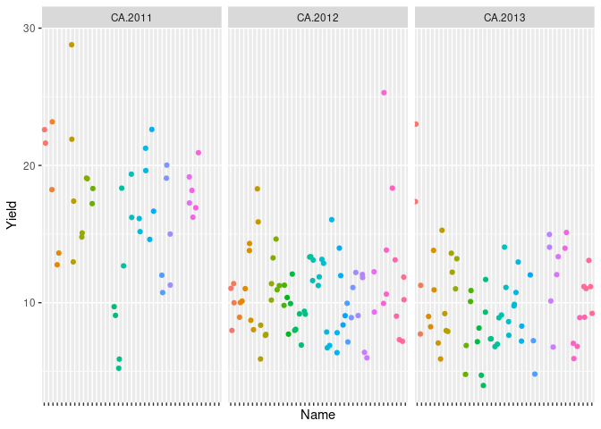

## Mixed models

Linear mixed models are a very powerful statistical tool that, simply put, allows to mix "fixed" (systematic) and "random" effects in one model equation:  


$$
\mathbf{y} = \mathbf{Xb} + \mathbf{Zu} + \mathbf{e}
$$

- **y**: vector of response (target) variable (observations) $(n,1)$
- **b**: vector of fixed effects $(f,1)$
- **u**: vector of random effects $(r,1)$
- **e**: vector of model residuals $(n,1)$
- **X**: design matrix that relates observations (responses) with fixed effects $(n,f)$
- **Z**: design matrix that relates observations (responses) with random effects $(n,r)$

The *letters* between brackets refer to the vector/matrix dimensions: *n* for the number of records (observations), *f* for the number of fixed effects, *r* for the number of random effects.

This is a **linear additive mixed model**: 

- *linear* because it is a linear combination of variables (a.k.a. "parameters"): **b**, **u** (and *e*)
- *additive* because variables are summed together
- *mixed* because (again) it mixes fixed and random effects

While **fixed effects** are just point estimates of an underlying *true* value, **random effects** are associated with a distribution and, importantly, a **variance component**. 
The total variance of the observations (**y**'s) is partitioned into one component belonging to the random effect **u** and the residual variance:


$$
Var(\mathbf{y}) = \mathbf{K} \sigma_u^2 + \mathbf{R} \sigma_e^2
$$

where:

- **K**: *covariance* (relationship) *matrix* between the observations (for the specific random effect)
- **R** is the residual covariance matrix, usually simplified to $\mathbf{I}$ (identity matrix) under the assumption of independence between residuals


### Mixed models: an illustration in R

We take data on the yield of 41 potato lines (`DT_example` dataset) from different environments (combination of location and year).
There are *185* records.


```r
library("sommer")
library("tidyverse")
data(DT_example)
DT <- DT_example

head(DT)
```

```
##                   Name     Env Loc Year     Block Yield    Weight
## 33  Manistee(MSL292-A) CA.2013  CA 2013 CA.2013.1     4 -1.904711
## 65          CO02024-9W CA.2013  CA 2013 CA.2013.1     5 -1.446958
## 66  Manistee(MSL292-A) CA.2013  CA 2013 CA.2013.2     5 -1.516271
## 67            MSL007-B CA.2011  CA 2011 CA.2011.2     5 -1.435510
## 68           MSR169-8Y CA.2013  CA 2013 CA.2013.1     5 -1.469051
## 103         AC05153-1W CA.2013  CA 2013 CA.2013.1     6 -1.307167
```

We first look at the distribution of the quantitative response variable:


```r
hist(DT$Yield, xlab = "yield", main="response variable")
```

<!-- -->
Then at the distribution of observations (yield) per environemnt:


```r
p <- ggplot(DT, aes(x = Name, y = Yield)) + geom_jitter(aes(color=Name)) + facet_wrap(~Env)
p <- p + theme(legend.position = "none", axis.text.x = element_blank())
p
```

<!-- -->
### Fitting the mixed model

We now fit a mixed model of the form:


```r
tex = "\\mathbf{yield} = \\mathbf{X} \\cdot \\mathbf{env} + \\mathbf{Z} \\cdot \\mathbf{variety} + \\mathbf{e}"
katex_html(
  tex,
  displayMode = TRUE,
  include_css = TRUE,
  preview = interactive()
)
```

```{=html}
<link rel="stylesheet" type="text/css" href="https://cdn.jsdelivr.net/npm/katex@0.13.11/dist/katex.min.css" data-external="1">
<span class="katex-display"><span class="katex"><span class="katex-mathml"><math xmlns="http://www.w3.org/1998/Math/MathML" display="block"><semantics><mrow><mrow><mi mathvariant="bold">y</mi><mi mathvariant="bold">i</mi><mi mathvariant="bold">e</mi><mi mathvariant="bold">l</mi><mi mathvariant="bold">d</mi></mrow><mo>=</mo><mi mathvariant="bold">X</mi><mo>⋅</mo><mrow><mi mathvariant="bold">e</mi><mi mathvariant="bold">n</mi><mi mathvariant="bold">v</mi></mrow><mo>+</mo><mi mathvariant="bold">Z</mi><mo>⋅</mo><mrow><mi mathvariant="bold">v</mi><mi mathvariant="bold">a</mi><mi mathvariant="bold">r</mi><mi mathvariant="bold">i</mi><mi mathvariant="bold">e</mi><mi mathvariant="bold">t</mi><mi mathvariant="bold">y</mi></mrow><mo>+</mo><mi mathvariant="bold">e</mi></mrow><annotation encoding="application/x-tex">\mathbf{yield} = \mathbf{X} \cdot \mathbf{env} + \mathbf{Z} \cdot \mathbf{variety} + \mathbf{e}</annotation></semantics></math></span><span class="katex-html" aria-hidden="true"><span class="base"><span class="strut" style="height:0.8888799999999999em;vertical-align:-0.19444em;"></span><span class="mord"><span class="mord mathbf">yield</span></span><span class="mspace" style="margin-right:0.2777777777777778em;"></span><span class="mrel">=</span><span class="mspace" style="margin-right:0.2777777777777778em;"></span></span><span class="base"><span class="strut" style="height:0.68611em;vertical-align:0em;"></span><span class="mord mathbf">X</span><span class="mspace" style="margin-right:0.2222222222222222em;"></span><span class="mbin">⋅</span><span class="mspace" style="margin-right:0.2222222222222222em;"></span></span><span class="base"><span class="strut" style="height:0.66666em;vertical-align:-0.08333em;"></span><span class="mord"><span class="mord mathbf" style="margin-right:0.01597em;">env</span></span><span class="mspace" style="margin-right:0.2222222222222222em;"></span><span class="mbin">+</span><span class="mspace" style="margin-right:0.2222222222222222em;"></span></span><span class="base"><span class="strut" style="height:0.68611em;vertical-align:0em;"></span><span class="mord mathbf">Z</span><span class="mspace" style="margin-right:0.2222222222222222em;"></span><span class="mbin">⋅</span><span class="mspace" style="margin-right:0.2222222222222222em;"></span></span><span class="base"><span class="strut" style="height:0.8888799999999999em;vertical-align:-0.19444em;"></span><span class="mord"><span class="mord mathbf" style="margin-right:0.01597em;">variety</span></span><span class="mspace" style="margin-right:0.2222222222222222em;"></span><span class="mbin">+</span><span class="mspace" style="margin-right:0.2222222222222222em;"></span></span><span class="base"><span class="strut" style="height:0.44444em;vertical-align:0em;"></span><span class="mord mathbf">e</span></span></span></span></span>
```


$$
\mathbf{yield} = \mathbf{X} \cdot \mathbf{env} + \mathbf{Z} \cdot \mathbf{variety} + \mathbf{e}
$$


```r
fit <-mmer(fixed = Yield ~ Env, 
            random= ~ Name,
            rcov= ~ units,
            data=DT, 
            verbose = FALSE)
```


```r
summary(fit)
```

```
## ============================================================
##          Multivariate Linear Mixed Model fit by REML         
## **********************  sommer 4.1  ********************** 
## ============================================================
##          logLik      AIC      BIC Method Converge
## Value -32.59421 71.18842 80.84949     NR     TRUE
## ============================================================
## Variance-Covariance components:
##                   VarComp VarCompSE Zratio Constraint
## Name.Yield-Yield    4.856    1.5233  3.188   Positive
## units.Yield-Yield   8.109    0.9615  8.434   Positive
## ============================================================
## Fixed effects:
##   Trait      Effect Estimate Std.Error t.value
## 1 Yield (Intercept)   16.385    0.5849  28.012
## 2 Yield  EnvCA.2012   -5.688    0.5741  -9.908
## 3 Yield  EnvCA.2013   -6.218    0.6107 -10.182
## ============================================================
## Groups and observations:
##      Yield
## Name    41
## ============================================================
## Use the '$' sign to access results and parameters
```


```r
library("katex")
tex = "\\mathbf{yield} = \\mathbf{X} \\cdot \\mathbf{env} + \\mathbf{Z} \\cdot \\mathbf{variety} + \\mathbf{e}"
katex_html(
  tex,
  displayMode = TRUE,
  include_css = TRUE,
  preview = interactive()
)
```

```{=html}
<link rel="stylesheet" type="text/css" href="https://cdn.jsdelivr.net/npm/katex@0.13.11/dist/katex.min.css" data-external="1">
<span class="katex-display"><span class="katex"><span class="katex-mathml"><math xmlns="http://www.w3.org/1998/Math/MathML" display="block"><semantics><mrow><mrow><mi mathvariant="bold">y</mi><mi mathvariant="bold">i</mi><mi mathvariant="bold">e</mi><mi mathvariant="bold">l</mi><mi mathvariant="bold">d</mi></mrow><mo>=</mo><mi mathvariant="bold">X</mi><mo>⋅</mo><mrow><mi mathvariant="bold">e</mi><mi mathvariant="bold">n</mi><mi mathvariant="bold">v</mi></mrow><mo>+</mo><mi mathvariant="bold">Z</mi><mo>⋅</mo><mrow><mi mathvariant="bold">v</mi><mi mathvariant="bold">a</mi><mi mathvariant="bold">r</mi><mi mathvariant="bold">i</mi><mi mathvariant="bold">e</mi><mi mathvariant="bold">t</mi><mi mathvariant="bold">y</mi></mrow><mo>+</mo><mi mathvariant="bold">e</mi></mrow><annotation encoding="application/x-tex">\mathbf{yield} = \mathbf{X} \cdot \mathbf{env} + \mathbf{Z} \cdot \mathbf{variety} + \mathbf{e}</annotation></semantics></math></span><span class="katex-html" aria-hidden="true"><span class="base"><span class="strut" style="height:0.8888799999999999em;vertical-align:-0.19444em;"></span><span class="mord"><span class="mord mathbf">yield</span></span><span class="mspace" style="margin-right:0.2777777777777778em;"></span><span class="mrel">=</span><span class="mspace" style="margin-right:0.2777777777777778em;"></span></span><span class="base"><span class="strut" style="height:0.68611em;vertical-align:0em;"></span><span class="mord mathbf">X</span><span class="mspace" style="margin-right:0.2222222222222222em;"></span><span class="mbin">⋅</span><span class="mspace" style="margin-right:0.2222222222222222em;"></span></span><span class="base"><span class="strut" style="height:0.66666em;vertical-align:-0.08333em;"></span><span class="mord"><span class="mord mathbf" style="margin-right:0.01597em;">env</span></span><span class="mspace" style="margin-right:0.2222222222222222em;"></span><span class="mbin">+</span><span class="mspace" style="margin-right:0.2222222222222222em;"></span></span><span class="base"><span class="strut" style="height:0.68611em;vertical-align:0em;"></span><span class="mord mathbf">Z</span><span class="mspace" style="margin-right:0.2222222222222222em;"></span><span class="mbin">⋅</span><span class="mspace" style="margin-right:0.2222222222222222em;"></span></span><span class="base"><span class="strut" style="height:0.8888799999999999em;vertical-align:-0.19444em;"></span><span class="mord"><span class="mord mathbf" style="margin-right:0.01597em;">variety</span></span><span class="mspace" style="margin-right:0.2222222222222222em;"></span><span class="mbin">+</span><span class="mspace" style="margin-right:0.2222222222222222em;"></span></span><span class="base"><span class="strut" style="height:0.44444em;vertical-align:0em;"></span><span class="mord mathbf">e</span></span></span></span></span>
```

```r
# katex_mathml(tex, displayMode = TRUE, ...)
```

